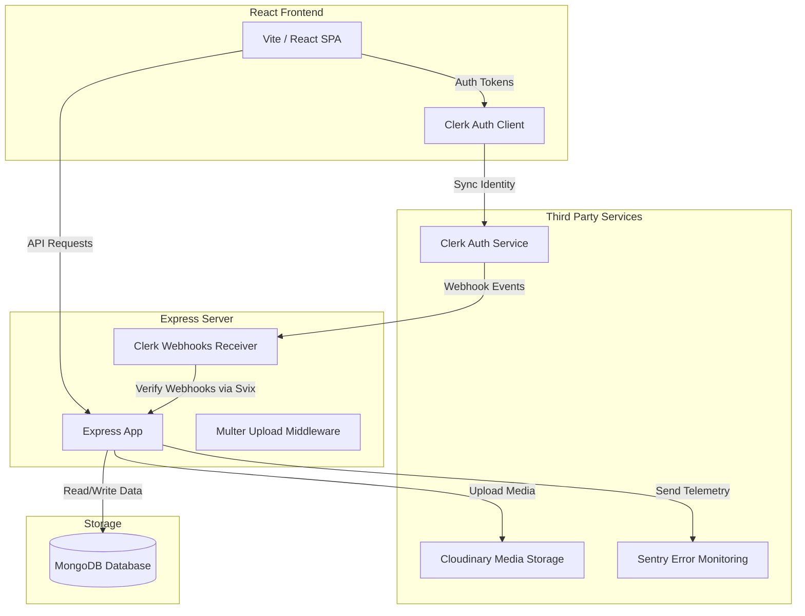

# 💼 CareerMap - Modern Job Portal Platform

Welcome to **CareerMap**, a full-featured, high-performance job portal designed to connect talented job seekers with recruiters. CareerMap features user authentication, a rich search interface, and a robust applicant tracking system for companies.

🔗 **Live Application URL:** [https://job-portal-client-pi-three.vercel.app/](https://job-portal-client-pi-three.vercel.app/)

---

## 🚀 Key Features

### 👤 For Job Seekers
* **Interactive Job Search:** Filter jobs instantly by title, location, category, or experience level.
* **Easy Application Process:** Apply to any listing with a single click after uploading your professional resume.
* **Dashboard / Application Tracker:** Real-time visibility into the status of all your applications (Pending, Accepted, or Rejected).
* **Clerk Secure Authentication:** Seamless user login, registration, and profile management.

### 🏢 For Recruiters
* **Recruiter Sign Up / Login:** Custom JWT-secured authentication portal with company profile setup.
* **Corporate Branding:** Cloudinary-backed logo upload to showcase company brand identity on all listings.
* **Job Posting & Management:** Post detailed roles using a Rich Text Editor (Quill.js) and toggle listings visibility on/off.
* **Applicant Review System:** Track applicants for each position, download resumes directly, and update application status dynamically.

### ⚙️ Under the Hood
* **Real-time Webhook Synchronization:** Keeps database records in perfect sync with Clerk authentication state.
* **Application Monitoring:** Global tracking with **Sentry** (for both frontend and backend) to log errors and measure performance.
* **Cloud Infrastructure:** Integrated with Cloudinary for handling and storing user resumes and company logos securely.

---

## 🛠️ Tech Stack

### Frontend Client
* **React 19 & Vite:** Next-generation React build tooling for hyper-fast development server and optimized bundles.
* **Tailwind CSS v4:** Modern utility-first CSS engine styling for beautiful glassmorphic visual aesthetics.
* **Clerk React SDK:** Identity platform for secure, frictionless user management.
* **React Router v7:** Multi-page app routing.
* **Quill Editor:** Rich text editor for structured job description input.
* **Axios:** Standardized HTTP client for talking to the REST API.
* **React Toastify:** Beautiful notifications and alert messages.

### Backend Server
* **Node.js & Express.js:** Fast, unopinionated, minimalist web framework for building APIs.
* **Mongoose & MongoDB:** Document-oriented database for structured collections of Users, Companies, Jobs, and JobApplications.
* **Svix:** Webhook validation verifying payload integrity from Clerk.
* **Sentry SDK:** Error monitoring and tracing tool.
* **Multer & Cloudinary:** Middleware for processing multipart/form-data upload and cloud hosting.
* **Bcrypt & JWT:** Password hashing and secure token generation for recruiter sessions.

---

## 📊 System Architecture



---

## ⚙️ Environment Configuration

To run this application locally, you will need to set up environment files (`.env`) in both the `/backend` and `/frontend` folders.

### 1. Backend Environment Variables (`/backend/.env`)
Create a file named `.env` in the `backend` folder and add:
```env
PORT=3000
MONGO_URI=your_mongodb_connection_string
JWT_SECRET=your_jwt_secret_key

# Cloudinary Config
CLOUDINARY_NAME=your_cloudinary_name
CLOUDINARY_API_KEY=your_cloudinary_api_key
CLOUDINARY_SECRET_KEY=your_cloudinary_secret_key

# Clerk Config
CLERK_WEBHOOK_SECRET=your_clerk_webhook_secret_from_dashboard
CLERK_PUBLISHABLE_KEY=your_clerk_publishable_key
CLERK_SECRET_KEY=your_clerk_secret_key
```

### 2. Frontend Environment Variables (`/frontend/.env`)
Create a file named `.env` in the `frontend` folder and add:
```env
VITE_CLERK_PUBLISHABLE_KEY=your_clerk_publishable_key
VITE_BACKEND_URL=http://localhost:3000
```

---

## 💻 Local Setup & Installation

### Prerequisites
Make sure you have [Node.js](https://nodejs.org/) installed (v18+ recommended).

### Steps
1. **Clone the Repository:**
   ```bash
   git clone <repository-url>
   cd job-portal
   ```

2. **Setup the Backend:**
   ```bash
   cd backend
   npm install
   # Configure your backend .env file here
   npm run dev
   ```
   The backend server will launch on `http://localhost:3000`.

3. **Setup the Frontend:**
   Open a new terminal window:
   ```bash
   cd frontend
   npm install
   # Configure your frontend .env file here
   npm run dev
   ```
   The frontend development server will launch on `http://localhost:5173`.

---

## 📂 Project Directory Structure

```text
├── backend/
│   ├── src/
│   │   ├── config/          # MongoDB, Cloudinary & Sentry configuration
│   │   ├── controller/      # API Controllers (Auth, Company, Jobs, Users, Webhooks)
│   │   ├── middleware/      # Auth & Multer middlewares
│   │   ├── model/           # Mongoose Schemas (User, Company, Job, JobApplication)
│   │   ├── Route/           # Express router endpoints mapping
│   │   ├── utils/           # Helper functions (JWT generators)
│   │   └── server.js        # Backend application entry point
│   ├── .env                 # Backend keys config
│   └── package.json
│
├── frontend/
│   ├── src/
│   │   ├── assets/          # Static assets, logos, and icons
│   │   ├── components/      # UI components (Hero, Navbar, Jobcard, Login Modal)
│   │   ├── context/         # AppContext for global state & API bindings
│   │   ├── pages/           # Page views (Home, ApplyJob, Dashboard, Applications)
│   │   ├── App.jsx          # Route mapping and core app wrapper
│   │   └── main.jsx         # App initialization point
│   ├── .env                 # Frontend keys config
│   └── package.json
└── README.md                # Project documentation
```
